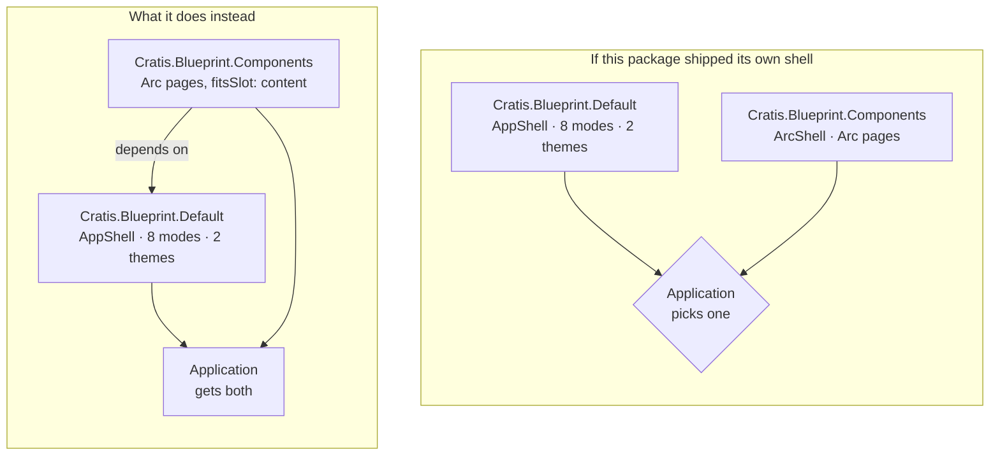

Open this package's manifest and the first thing that looks wrong is an empty array:

```typescript
export const componentsBlueprintManifest: ScenePackage = {
    name: componentsBlueprintName,
    version: '1.0.0',
    kind: PackageKind.Blueprint,
    dependencies: [{ name: 'Cratis.Blueprint.Default' }, { name: 'Cratis.Components' }],
    components: Object.values(ComponentName),
    layouts: [],
    // ...
    themes: [],
};
```

A blueprint is *the package that ships the shape of an application* — its layouts, the templates built on
them, the components that fill their slots, the themes that color all of it. This one ships no layout at
all. It is worth being clear that this is the design, because it is the first blueprint-on-blueprint
dependency in Scene and the empty array is easy to read as an unfinished list.

## An application activates one shell

A **layout** is an application's base navigational shell, and an application has exactly one. That is not a
limitation of the model, it is what the word means: the shell is the thing every page lives inside, and
there cannot be two.

So a blueprint that ships a layout is, in effect, asking to be the only blueprint. Two of them are mutually
exclusive by construction, and choosing between them is choosing between everything each one holds.



On the left, picking Arc-bound pages costs you the eight menu modes, the themes, the navigation
aggregation and the sixteen shell components the default blueprint already does well. On the right it costs
nothing. Layering is the only arrangement in which either package is worth having.

## What the dependency actually does

The dependency is not a formality. Almost everything structural on these pages comes from the other
blueprint:

- **Its slot vocabulary.** Every template's `fitsSlot` is `SlotName.Content` — the default blueprint's
  `AppShell` slot — and every template's own slots are `TemplateSlotName` values. No slot name here is
  invented, because a name this package made up would fit nothing.
- **Its shell components.** The gallery's chrome is built from `topbar`, `sidebar`, `menu`, `menuItem`,
  `breadcrumb`, `footer`, `configPanel`, `logo` and `userMenu` — all names the default blueprint declares.
- **Its element builders.** `externalComponent` is imported rather than reimplemented, because
  `ExternalComponent` has fifteen required members before the two a template author cares about, and a
  second copy of those defaults is a second thing to keep right.
- **Its composition rules.** `nestScreenTemplates`, `templateContentInLayout` and `composeScreenElement`
  place a template inside the layout, and reimplementing them would mean re-deriving `fitsSlot` semantics.
- **Its themes and its layout modes.** Which is why there is a story rendering an Arc page in the shell's
  slim mode: an Arc page dropped into `content` gets all eight modes for free.

The one thing this package brings that the other does not is Arc binding. That is a genuinely different
axis, and it is why the two are separable packages rather than one.

## Themes are empty for the same reason, smaller

`@cratis/components` reads a `--cratis-*` variable layer that resolves whatever theme is active underneath
it, so the library asserts no palette. The shell being themed is the default blueprint's. A theme shipped
here would be this package asserting a look for a shell it does not own — so it ships none, and the
configurator on every gallery screen offers the default blueprint's themes:

```typescript
function configPanel(): SceneElement {
    return externalComponent(DefaultComponentName.ConfigPanel, DefaultComponentName.ConfigPanel, {
        title: 'Settings',
        themes: defaultBlueprintThemes.map(theme => ({ name: theme.name, label: theme.name, isDark: theme.isDark ?? false })),
    });
}
```

## One component, and why even that one

The same reasoning runs down to the component registry, which has exactly one entry:

```typescript
export const componentsBlueprintComponents: ComponentRegistry = {
    [componentRegistryKey(componentsBlueprintName, ComponentName.ArcPageHeader)]: ArcPageHeader,
};
```

The rule this package holds itself to is: register a component only when a template's content tree
genuinely cannot express the composition, and reach for a template every other time. A template is data a
host can rearrange; a component is code it cannot. A blueprint whose value sat in its components rather
than its templates would have misunderstood its job.

`arcPageHeader` clears the bar because it *derives* rather than holds. Give it one binding name and it
produces the heading, the breadcrumb trail and the design-time binding state:

```typescript
export function deriveArcHeading(properties: Record<string, unknown>, binding: ElementBinding, kind: BindingKind): ArcHeading {
    const title = stringProperty(properties, 'title') ?? (binding.name === undefined ? 'Untitled page' : humanizeBindingName(binding.name));
    const section = stringProperty(properties, 'section');

    return {
        title,
        subtitle: stringProperty(properties, 'subtitle'),
        trail: section === undefined ? [title] : [section, title],
        bindingName: binding.name,
        isBound: binding.target !== undefined,
        bindingLabel: bindingLabelFor(binding, kind),
    };
}
```

A tree can hold a title, a subtitle and a trail as three literals — and then those three literals drift the
first time anything is renamed. It cannot derive them from one name, and it certainly cannot look that name
up in the binding registry to report whether a host has wired it. Both are behavior at render time, not
structure, which is exactly the line.

Note also what it does *not* do: it registers `arcPageHeader`, not `pageHeader`. Shadowing the default
blueprint's page header would silently change that blueprint's own screens, which is not a decision this
package gets to make on its behalf.

## Where to go next

- [Add a template of your own](add-a-template.md) — the same rules, applied to your code.
- [The template catalogue](template-catalogue.md) — every template and the slots it declares.
- [Understanding blueprints](../blueprints/understanding-blueprints.md) — what a blueprint is in general.
