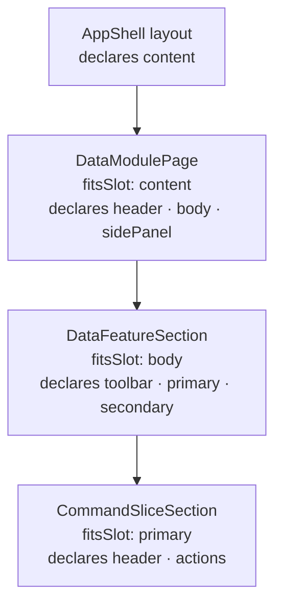

Every template here fills the default blueprint's `AppShell` layout. Names are as a `Screen` refers to
them; slots are `TemplateSlotName` values.

## Screen templates

All eight page templates set `fitsSlot: SlotName.Content`, which is the only region a layout offers a
screen. The three nesting-chain templates fit each other.

| Template | Slots | Bindings | What it is |
|---|---|---|---|
| `DataListPage` | `header`, `body` | `AllInvoices` | A `dataPage` filling the body, under a header stating the binding |
| `ObservableDataListPage` | `header`, `body` | `InvoicesInFlight` | The same shape over an observable query |
| `DataListWithDetailPage` | `header`, `body`, `sidePanel` | `AllInvoices` | The list, plus the record's document, trail and history |
| `MasterDetailPage` | `header`, `primary`, `secondary` | `AllInvoices` | A `dataTable` in the larger column, the record in the narrower |
| `DashboardPage` | `header`, `stats`, `primary`, `secondary` | `RevenueByMonth`, `InvoicesInFlight`, `OpenTickets`, `AllInvoices`, `AllAdjustments` | Query-backed widgets over a wide and a narrow column |
| `CommandFormPage` | `header`, `body`, `actions` | `RegisterInvoice` | A generated command form with its own action bar |
| `SchemaEditorPage` | `header`, `toolbar`, `body` | none | An event type's schema as a typed property tree |
| `ObjectEditorPage` | `header`, `toolbar`, `body`, `sidePanel` | `InvoiceById` | One document against its schema, with trail and history |
| `DataModulePage` | `header`, `body`, `sidePanel` | none | Module level — fits the layout's `content` |
| `DataFeatureSection` | `toolbar`, `primary`, `secondary` | `InvoicesInFlight` | Feature level — fits the module's `body` |
| `CommandSliceSection` | `header`, `actions` | `RecordAdjustment` | Slice level — fits the feature's `primary` |

### Which list template to reach for

Three of them look alike and are not.

`DataListPage` is a whole `dataPage` — its own title bar, menubar and filtering — and is what you want when
the page *is* the list.

`DataListWithDetailPage` is that same `dataPage` with a detail region added beside it.

`MasterDetailPage` is a plain `dataTable` next to a detail region, and is right when the page's chrome comes
from the feature around it rather than from the list itself. Reaching for the wrong one shows up as a page
with two toolbars.

### Which pages render without a backend

`SchemaEditorPage` and `ObjectEditorPage` render completely with nothing registered, because the editors
they are built from read their content out of the property bag. Every other page renders its header,
toolbar and chrome, and shows a placeholder where the queried region will be. See
[wiring the binding registry](wiring-the-binding-registry.md) for the full split.

### The nesting chain

Three templates that demonstrate `fitsSlot` composing to depth, and the slot names are chosen so each
fitted name has exactly one declarer:

`resolveScreenTemplates` places all three, at depths 1, 2 and 3. A chain reusing `body` at every level would
read perfectly and resolve to nothing — see [add a template of your own](add-a-template.md) for why.

## Dialog templates

A dialog template has no `fitsSlot`, because an overlay occupies no slot: it is summoned, not placed.

| Template | Slots | Binding | What it is |
|---|---|---|---|
| `CommandDialog` | `body` | `RecordAdjustment` | A short capture whose confirm button is the command's execution |
| `ConfirmDialog` | `body` | none | One question, with the consequence spelled out |
| `BusyDialog` | `body` | none | The blocking spinner for a long-running command |

Each declares exactly **one** slot, which is a deliberate departure from how the default blueprint builds
its dialogs. That blueprint composes a dialog out of primitives — a title, a message, a row of buttons —
because primitives are all it has. Here the library ships whole dialogs that resolve their result through
Arc's dialog context, so the frame, the title bar and the buttons all belong to the composite. A template
declaring `header` and `actions` slots would be offering regions that render *outside* the modal, which is
worse than not offering them: a screen would fill them, and the content would appear somewhere nobody
expected.

`CommandDialog` places its fields by hand rather than generating them, which is the opposite choice from
`CommandFormPage` and deliberate. A dialog is a *short* capture — three or four properties a person can
answer in an overlay. Generating every property of the command would turn an overlay into a page, which is
precisely the decision a dialog has already made.

## Element builders

Exported so an application can write its own templates from the same parts.

| Builder | Produces |
|---|---|
| `arcPageHeader(id, options, actions?)` | This blueprint's page header |
| `page(id, title, content, panel?)` | The library's `page` primitive wrapping content |
| `dataPage(id, query, options, columns)` | The whole list-screen composite |
| `dataTable(id, query, options, columns)` | Server-side querying without page chrome |
| `observableDataTable(id, query, options, columns)` | The live variant |
| `columns(id, definitions)` | PrimeReact `column` children for a table |
| `commandForm(id, command, exclude?)` | A form generated from the command's own properties |
| `inputTextField` · `numberField` · `textAreaField` · `calendarField` · `dropdownField` | One field bound to one command property |
| `dialog(id, title, okLabel, cancelLabel, content)` | The Arc-aware dialog |
| `commandDialog(id, command, title, okLabel, fields)` | A dialog that submits a command |
| `busyIndicatorDialog(id, title, message)` | The blocking spinner |
| `schemaEditor` · `objectContentEditor` · `objectNavigationalBar` · `timeMachine` · `filterPanel` | The Arc-free editors |
| `toolbar` · `toolbarButton` · `toolbarGroup` · `toolbarSeparator` | The tool palette family |
| `errorBoundary(id, content)` · `icon(id, iconName)` | Region isolation, and an icon |

Bindings are passed as plain strings, so the same builders work with your own proxy names.
`SampleBindingName` is an enum of the names the shipped templates use, not a closed set of everything a
binding may be.

## Components

One, registered under `componentRegistryKey('Cratis.Blueprint.Components', 'arcPageHeader')`.

| Name | Properties | Slots |
|---|---|---|
| `arcPageHeader` | `title`, `subtitle`, `section`, `query`, `command` | `actions` |

It derives its heading from `title`, falling back to the binding name read as a sentence; its trail from
`section` and the heading; and its design-time state from a binding-registry lookup:

| Rendered | Meaning |
|---|---|
| `Bound to query AllInvoices` | A host registered a class under that name |
| `No query registered as AllInvoices` | Named, but nothing registered |
| `No binding` | The template names none, deliberately |

It carries `data-scene-binding` and `data-scene-binding-state` attributes, so a preview surface can be
scanned for what is still unwired.

## The names these templates write

Every bare name a template references resolves against a catalog built from the real manifests of `core`,
`PrimeReact`, `Cratis.Components`, `Cratis.Blueprint.Default` and this package — and a spec proves it, so a
name renamed upstream fails here rather than rendering as a dashed box in your application.

- **From `Cratis.Components`:** `page`, `dataPage`, `dataTable`, `observableDataTable`, `commandForm`,
  `inputTextField`, `numberField`, `textAreaField`, `dropdownField`, `calendarField`, `dialog`,
  `commandDialog`, `busyIndicatorDialog`, `icon`, `dropdown`, `errorBoundary`, `objectContentEditor`,
  `objectNavigationalBar`, `schemaEditor`, `timeMachine`, `filterPanel`, `toolbar`, `toolbarButton`,
  `toolbarGroup`, `toolbarSeparator`.
- **From `Cratis.Blueprint.Default`:** `appShell`, `topbar`, `sidebar`, `menu`, `menuItem`, `breadcrumb`,
  `footer`, `configPanel`, `logo`, `userMenu`.
- **From `PrimeReact`:** `column`, and only `column` — the library's tables take PrimeReact `Column`
  children and declare no `column` name of their own.
- **From this package:** `arcPageHeader`.

## Where to go next

- [Wire the binding registry](wiring-the-binding-registry.md) — supplying the classes these names want.
- [Add a template of your own](add-a-template.md) — when none of the above is the shape you need.
- [Layering on another blueprint](layering-on-a-blueprint.md) — why the component list is one entry long.
