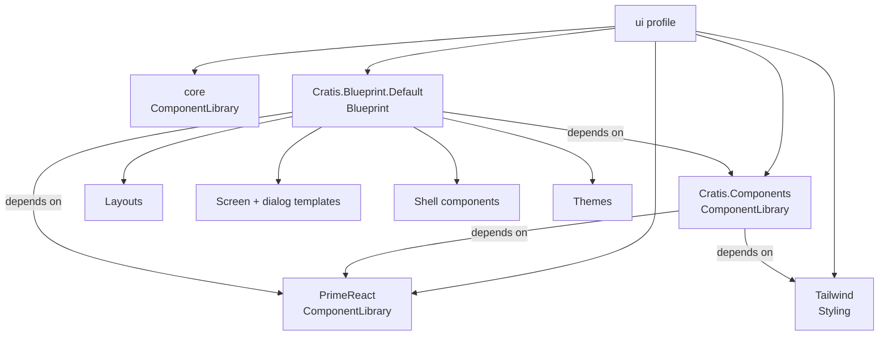

A component library gives you widgets. A blueprint gives you an application.

That sounds like a slogan, so here is the concrete version. `@cratis/scene.primereact` declares eighty-odd
component names - `inputText`, `dataTable`, `dialog`, `timeline`. Every one is a thing you can put
somewhere. None of them tells you *where*. The decisions a real application still has to make after
picking a component library are: where the navigation lives, what happens to it below 991px, what a
dashboard is shaped like, what a sign-in page is shaped like, what an error page says, and whether all of
those look like the same product.

Those decisions are what a blueprint is.

## The three package kinds

`PackageKind` has three values, and they answer different questions.

| Kind | Answers | Example |
| --- | --- | --- |
| `ComponentLibrary` | what widgets can I place? | PrimeReact, Cratis Components, `core` |
| `Styling` | what CSS system are those widgets written against? | Tailwind |
| `Blueprint` | what does the application *look like*? | the default blueprint |

A profile mixes all three freely, and the kind never decides override priority - that is declaration
order's job. What the kind does decide is what a package is allowed to be vague about. A component library
ships no layouts and no templates, on purpose: shipping one opinionated data page nobody can rearrange is
worse than shipping a `dataTable` a blueprint can place in a slot and configure.



## A blueprint declares what it is built from

This is the part that is easy to skip and expensive to skip. A blueprint's shells are built out of
somebody else's widgets, so it says so:

```ts
export const defaultBlueprintManifest: ScenePackage = {
    name: 'Cratis.Blueprint.Default',
    version: '1.0.0',
    kind: PackageKind.Blueprint,
    dependencies: [{ name: 'PrimeReact' }, { name: 'Cratis.Components' }],
    // ...
};
```

A profile that activates this blueprint without PrimeReact renders a shell whose every button, breadcrumb
and overlay is a dashed red placeholder. Declaring the dependency is what lets `resolvePackageDependencies`
say so while the profile is being configured, rather than leaving it to be discovered when somebody opens
the page.

## Why the gallery is real screens

The default blueprint ships twenty-three `Screen` instances alongside its templates. They are not
screenshots and not fixtures for a bespoke preview pipeline - they are the same `Screen` shape a real
application produces, put through the same engine and the same React renderer.

That costs almost nothing and buys a specific thing: when you open the gallery and the dashboard renders,
you have learned that the blueprint works, not that somebody drew a picture of it working. And when a
component name in a template is wrong, the gallery is where it goes red - during the blueprint's own
specs, rather than in your application three weeks later.

## When a blueprint is the wrong fit

Be honest about the limits:

- **You only need widgets.** If your application already has a shell and a design language, a blueprint
  brings decisions you have already made. Take the component library and stop.
- **Your navigation is not a sidebar.** The default blueprint's eight modes are all answers to "where does
  the sidebar go". An application whose primary navigation is a command palette, a canvas, or a document
  outline is not served by any of them - it wants a blueprint of its own, which is a day's work rather
  than a fork.
- **You need one screen to break the rules.** That is fine and does not need a blueprint at all: a screen
  can fill the layout's `content` slot directly, without naming a screen template.

## Next

- [Layouts](./layouts.md) and [screen and dialog templates](./screen-templates.md) - the four concepts
  inside a blueprint.
- [Composing screens from templates](./composing-screens.md) - how they are actually placed.
- [Ship your own blueprint](./ship-your-own-blueprint.md) - the recipe, when the default is not your look.
