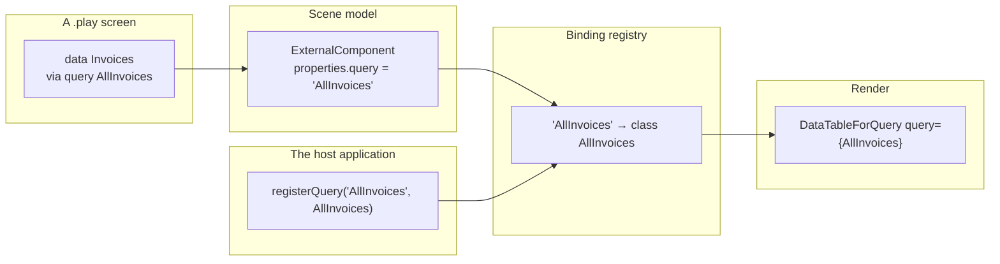

A screen says which data it wants:

```screenplay
data Invoices via query AllInvoices
```

`AllInvoices` is a *name*. By the time that reaches a renderer it is an `ExternalComponent` whose properties
bag holds the string `'AllInvoices'`, because a `.play` document is text, Stage compiles it, and Studio reads
it back — and nothing in that round trip can carry a TypeScript class.

`DataTableForQuery` needs the class:

```tsx
<DataTableForQuery query={AllInvoices} emptyMessage='No invoices' />
```

That gap is real and it is not closable from inside Scene. An adapter cannot conjure a query class out of a
string, and it should not try — guessing at a module path or reaching into a global would move the failure
somewhere worse. The name is the only thing that survives, so the name is what the lookup has to be keyed on.

## The seam



Only the host owns the generated Arc proxies, so only the host can supply the class. It registers every proxy
a screen can name, once, at startup:

```typescript
import { registerQueries, registerCommands } from '@cratis/scene.components';
import { AllInvoices, InvoiceById } from './Invoices/proxies';
import { RegisterInvoice } from './Invoices/RegisterInvoice';

registerQueries({ AllInvoices, InvoiceById });
registerCommands({ RegisterInvoice });
```

Object shorthand is the point of the bulk form: Stage generates a module that exports every proxy it
produced, and handing that module's exports straight in stays correct as proxies are added and removed
without anyone editing a list.

## The API

| Function | Purpose |
|---|---|
| `registerQuery(name, queryClass)` | Register one Arc query proxy under the name screens refer to it by. |
| `registerQueries(bindings)` | Register several at once, keyed by name. |
| `resolveQuery(name)` | The registered class, or `undefined`. |
| `registerCommand(name, commandClass)` | The command half of `registerQuery`. |
| `registerCommands(bindings)` | Register several commands at once. |
| `resolveCommand(name)` | The registered class, or `undefined`. |
| `registeredQueryNames()` | Every registered query name, sorted. |
| `registeredCommandNames()` | Every registered command name, sorted. |
| `clearBindings()` | Forget everything. |

Queries and commands are separate namespaces. They are opposite halves of CQRS, and a screen means exactly
one of them at each site — letting a command satisfy a query binding would turn a modeling mistake into a
runtime one.

Registering the same name twice replaces the earlier registration, so a host can re-register on hot reload
without unwinding the previous run. `clearBindings()` exists because the registry is module-level state:
right for a host that registers once at startup, wrong for Studio switching between projects or a spec that
must not inherit what the previous one registered.

## The classes are not typed as Arc types

`registerQuery` takes a `BoundConstructor` — "something that can be constructed" — not
`Constructor<IQueryFor<T>>`:

```typescript
export type BoundConstructor = new (...args: never[]) => object;
```

Scene deliberately does not depend on Arc. A Scene screen is a UI model, and the whole point of the registry
is that Scene never has to know what an Arc proxy *is*. Whether a registered class really is a query is the
host's responsibility — and the host checks it where it registers, with the real Arc types in scope, which is
exactly where that check belongs.

## A missing binding is a visible placeholder, never a throw

`resolveQuery` returns `undefined` rather than throwing, and every Arc-bound adapter turns that into a
dashed-out box naming what it wanted:

```text
Unresolved query binding 'AllInvoices' on Cratis.Components:dataTable
```

A screen that names no query at all reads differently, because it is a different mistake:

```text
Missing query binding on Cratis.Components:dataTable
```

The first needs the host to register that name; the second needs the screen edited. The message is enough to
tell them apart without opening a debugger.

This matters most in Studio. Design-time preview normally has *nothing* registered — there is no backend to
query — and the screen still has to be usable so its layout can be worked on. One unbound table costs one
dashed box, not the whole screen. The presentation deliberately matches `UnresolvedComponent` in
`@cratis/scene.react`: the same class of failure at two different depths, and a designer scanning a preview
should recognize both instantly as "something here is not wired up".

## The Arc runtime is loaded only when it is needed

`@cratis/arc` and `@cratis/arc.react` are peer dependencies of `@cratis/components` that the host supplies.
A design surface is not a host, so every adapter that reaches them does so through a dynamic `import()`:

```tsx
const DataTableForQuery = lazy(async () => ({ default: (await import('@cratis/components/DataTables')).DataTableForQuery }));
```

A screen made only of the library's Arc-free components — pages, toolbars, editors, tooltips — therefore
never pulls the Arc client in at all, and an unbound table never even reaches the import. When a binding *is*
registered, the chunk loads behind an `ArcRuntimeBoundary`: `Suspense` while it is in flight, and
`@cratis/components`' own `ErrorBoundary` if it cannot load, which is what a host without Arc installed
sees. One dashed-out region, not a blank screen and not a thrown render.

## Where to go next

- [Component reference](components.md) — which components take a binding, and under which property.
- [What this package does not cover](coverage.md) — the other deliberate limits.
