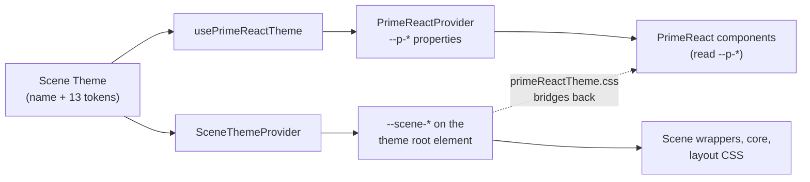

A screen written in Screenplay says `button`. It does not say `PrimeReact.Button`, and it does not import
anything. Something has to turn that name into a real React component — and that something is a package.

`@cratis/scene.primereact` is the package that turns Scene's abstract names into PrimeReact 11 components.
Add `PrimeReact` to a `ui profile` and 87 names become resolvable, 25 themes become selectable, and every
screen you have already written renders through a real, themed component library without a single edit.

## Without it, and with it

Without a component library in the profile, a `ui profile` still resolves — `core` is always the final
fallback, so `button` renders as an unstyled `<button>` and `card` as a bare `<div>`. That is enough to
prove a screen's structure and nothing more.

```screenplay
ui profile Desktop
  target platform web

  packages
    core
```

Add PrimeReact and the same screens keep working, but every shared name now resolves to a themed
component:

```screenplay
ui profile Desktop
  target platform web

  packages
    core
    Tailwind
    PrimeReact
```

Nothing in the screen changed. `button` now resolves to PrimeReact's `Button`, and the profile records
that it shadowed `core`'s — see [Understanding name resolution](./understanding-name-resolution.md) for
why that is the mechanism and not a collision.

## What the package declares

```ts
import { primeReactPackageManifest } from '@cratis/scene.primereact';

primeReactPackageManifest.name;         // 'PrimeReact'
primeReactPackageManifest.version;      // '11.1.0'
primeReactPackageManifest.kind;         // PackageKind.ComponentLibrary
primeReactPackageManifest.dependencies; // [{ name: 'Tailwind' }]
primeReactPackageManifest.components;   // 87 abstract names
primeReactPackageManifest.themes;       // 25 theme names
```

The Tailwind dependency is worth explaining, because it surprises people. PrimeReact's own components need
nothing from Tailwind — they are skinned by a compiled theme stylesheet. The dependency is there because
*this package's wrappers* use Tailwind utility classes for the layout around them: the row a checkbox and
its label sit on, the column a radio group stacks into, the grid a summary lays its pairs out in. A profile
that activates PrimeReact without Tailwind renders those wrappers unstyled. Declaring the dependency is what
makes a profile picker offer Tailwind alongside PrimeReact, instead of leaving the gap to be discovered on
screen.

The manifest declares no layouts, screen templates or dialog templates, and that is deliberate rather than
unfinished. A component library supplies the vocabulary a template is built *from*; a **blueprint** package
supplies the layout and the templates themselves. See [Blueprints](../blueprints/index.md).

## The two halves of theming

A PrimeReact 11 theme is a `@primeuix/themes` preset object, which `@primeuix/styled` turns into `--p-*`
custom properties at runtime. So theming a Scene screen that uses this package takes two things working
together:



Neither half is enough alone: drop the hook and PrimeReact's components render unstyled; drop the provider
and the wrappers around them do not follow. [Switch themes live](./switch-themes-live.md) shows the wiring,
and [Understanding design tokens](./understanding-design-tokens.md) explains the bridge in the middle.

## Where to go next

| If you want to | Read |
| --- | --- |
| Know why `button` resolves here and not to `core` | [Understanding name resolution](./understanding-name-resolution.md) |
| Understand the token vocabulary and the CSS bridge | [Understanding design tokens](./understanding-design-tokens.md) |
| Wire up a theme picker that switches without a reload | [Switch themes live](./switch-themes-live.md) |
| Look up what an abstract name maps to | [Component reference](./component-reference.md) |
| See every theme, its author and its license | [Theme reference](./theme-reference.md) |
| Plan the move to PrimeReact 11 | [Migrating to PrimeReact 11](./primereact-11-migration.md) |
