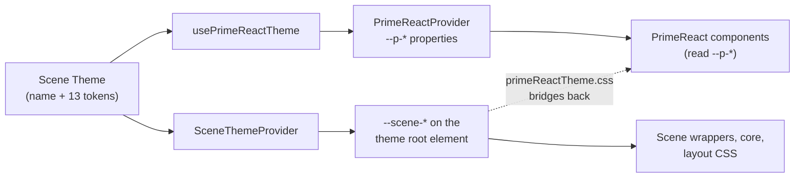

A screen written in Screenplay says `button`. It does not say `PrimeReact.Button`, and it does not import
anything. Something has to turn that name into a real React component — and that something is a package.

`@cratis/scene.primereact` is the package that turns Scene's abstract names into PrimeReact 11 components.
Add `PrimeReact` to a `ui profile` and 89 names become resolvable, 24 themes become selectable, and every
screen you have already written renders through a real, themed component library without a single edit.

## Without it, and with it

Without a component library in the profile, a `ui profile` still resolves — `core` is always the final
fallback, so `button` renders as an unstyled `<button>` and `card` as a bare `<div>`. That is enough to
prove a screen's structure and nothing more.

```screenplay
ui profile Desktop
  target platform web

  packages
    core
```

Add PrimeReact and the same screens keep working, but every shared name now resolves to a themed
component:

```screenplay
ui profile Desktop
  target platform web

  packages
    core
    Tailwind
    PrimeReact
```

Nothing in the screen changed. `button` now resolves to PrimeReact's `Button`, and the profile records
that it shadowed `core`'s — see [Understanding name resolution](./understanding-name-resolution.md) for
why that is the mechanism and not a collision.

## What the package declares

```ts
import { primeReactPackageManifest } from '@cratis/scene.primereact';

primeReactPackageManifest.name;         // 'PrimeReact'
primeReactPackageManifest.version;      // '11.1.0'
primeReactPackageManifest.kind;         // PackageKind.ComponentLibrary
primeReactPackageManifest.dependencies; // [{ name: 'Tailwind' }]
primeReactPackageManifest.components;   // 89 abstract names
primeReactPackageManifest.themes;       // 24 theme names
```

The Tailwind dependency is worth explaining, because it surprises people. PrimeReact's own components need
nothing from Tailwind — they are skinned by a compiled theme stylesheet. The dependency is there because
*this package's wrappers* use Tailwind utility classes for the layout around them: the row a checkbox and
its label sit on, the column a radio group stacks into, the grid a summary lays its pairs out in. A profile
that activates PrimeReact without Tailwind renders those wrappers unstyled. Declaring the dependency is what
makes a profile picker offer Tailwind alongside PrimeReact, instead of leaving the gap to be discovered on
screen.

The manifest declares no layouts, screen templates or dialog templates, and that is deliberate rather than
unfinished. A component library supplies the vocabulary a template is built *from*; a **blueprint** package
supplies the layout and the templates themselves. See [Blueprints](../blueprints/index.md).

## Charts and multi-state choices

Legacy screens can use `chart` and `multiStateCheckbox` as bare component names once the profile includes
`PrimeReact`. PrimeReact 11 removed both of the old widgets, so Scene supplies its own.

A `chart` passes its authored Chart.js `data` and `options` through unchanged. New documents use a stable
string type such as `bar` or `doughnut`. The renderer also accepts the numeric chart-type values saved by the
earlier .NET model (`0` Bar, `1` Line, `2` Pie, `3` Doughnut, `4` PolarArea, `5` Radar, `6` Bubble,
`7` Scatter) and the original Pascal case member names, so migration never rewrites a stored `type`. Any other
value, such as `8`, `'3'` or `'polararea'`, is reported on the chart as an unsupported type; a bar chart is
never drawn in its place. The descriptor lists both the names and the numeric values as choices, so a migrated
chart stays editable with its original value.

A chart with no data points says so (`emptyLabel`, "No chart data" by default) instead of drawing a blank
canvas, and a chart Chart.js cannot draw reports why. The chart fills its authored size;
`options.maintainAspectRatio` can ask for a fixed ratio. It rebuilds only when its type, data or options change
in content, so editing something else in the document does not redraw it.

:::caution[Hosts must install chart.js]
`chart.js@^4.5.1` is an optional peer dependency, so an application that renders charts has to install it.
A bundler that cannot resolve `chart.js/auto` fails the build, or the chart reports that it could not be
drawn. The adapter imports Chart.js only after the canvas mounts, so server rendering is safe.
:::

`multiStateCheckbox` cycles through its `options` in authored order. Option values keep their type: strings,
numbers, booleans, `null` and objects are all valid, and an option is never dropped for lacking a text label.
As in the original control, `optionLabel` and `optionValue` name the fields to use, and an option with no value
field is its own value. An option whose value is `null` is the empty state when `empty` is on; the control
adds its own empty state only when none is authored. Options that share a value are all reachable. The control
follows the document: a changed `value` or `options` is shown immediately.

It is a native button, not a checkbox, because a cycle has more than two states. Its name is the authored
`ariaLabel`, the current state is its description and is announced politely as it changes, and it never
claims to be checked. `readOnly` keeps it focusable but fixed; `disabled` takes it out of the tab order. The box
follows the PrimeReact checkbox tokens (`--p-checkbox-*`), so it takes on the active theme. Chart colors are
Chart.js defaults unless the authored options set them.

State icons are PrimeIcons class names, kept for legacy documents, or qualified icon references drawn through
the Scene icon system. The `emptyIcon` property is a regular icon property, so icon library diagnostics
cover it. Icons written inside the free-form `options` and `icons` JSON are drawn but are not tracked by
those diagnostics. Scene's interaction handlers carry no value, so behaviors are told that the selection
changed but not what it changed to.

## The two halves of theming

A PrimeReact 11 theme is a `@primeuix/themes` preset object, which `@primeuix/styled` turns into `--p-*`
custom properties at runtime. So theming a Scene screen that uses this package takes two things working
together:


```mermaid
flowchart LR
    Theme["Scene Theme<br/>(name + 13 tokens)"]
    Hook["usePrimeReactTheme"]
    Provider["SceneThemeProvider"]
    Preset["PrimeReactProvider<br/>--p-* properties"]
    Tokens["--scene-* on the<br/>theme root element"]
    Prime["PrimeReact components<br/>(read --p-*)"]
    Wrappers["Scene wrappers, core,<br/>layout CSS"]

    Theme --> Hook --> Preset --> Prime
    Theme --> Provider --> Tokens --> Wrappers
    Tokens -.->|primeReactTheme.css<br/>bridges back| Prime
```

Neither half is enough alone: drop the hook and PrimeReact's components render unstyled; drop the provider
and the wrappers around them do not follow. [Switch themes live](./switch-themes-live.md) shows the wiring,
and [Understanding design tokens](./understanding-design-tokens.md) explains the bridge in the middle.

## Where to go next

| If you want to | Read |
| --- | --- |
| Know why `button` resolves here and not to `core` | [Understanding name resolution](./understanding-name-resolution.md) |
| Understand the token vocabulary and the CSS bridge | [Understanding design tokens](./understanding-design-tokens.md) |
| Wire up a theme picker that switches without a reload | [Switch themes live](./switch-themes-live.md) |
| Look up what an abstract name maps to | [Component reference](./component-reference.md) |
| See every theme, its author and its license | [Theme reference](./theme-reference.md) |
| Plan the move to PrimeReact 11 | [Migrating to PrimeReact 11](./primereact-11-migration.md) |
