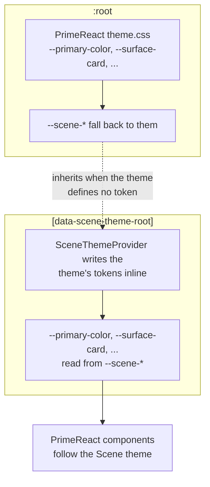

Write one rule that says `color: var(--text-color)` and you have quietly married your layout to PrimeReact.
Swap the component library and every such rule is a search-and-replace. Scene's token vocabulary is the
seam that prevents this: layout CSS, component CSS and screen styling all read `--scene-*`, and exactly one
file in each package knows what that maps to underneath.

## The vocabulary

Thirteen tokens. Deliberately small, because every Scene package has to agree on them and a vocabulary that
grows per package is one no package can rely on.

| Scene token | CSS custom property | What it means |
| --- | --- | --- |
| `primary.color` | `--scene-primary-color` | The brand accent |
| `primary.contrastColor` | `--scene-primary-contrast-color` | Text legible on the accent |
| `surface.background` | `--scene-surface-background` | The page canvas |
| `surface.card` | `--scene-surface-card` | A raised content surface |
| `surface.border` | `--scene-surface-border` | Separation between surfaces |
| `surface.hover` | `--scene-surface-hover` | The hover state of a surface |
| `surface.overlay` | `--scene-surface-overlay` | Dialogs, popovers, drawers |
| `text.color` | `--scene-text-color` | Body text |
| `text.mutedColor` | `--scene-text-muted-color` | Secondary and supporting text |
| `highlight.background` | `--scene-highlight-background` | Selected rows and options |
| `highlight.color` | `--scene-highlight-color` | Text on a highlight |
| `content.borderRadius` | `--scene-content-border-radius` | The corner radius of content |
| `focus.ring` | `--scene-focus-ring` | The keyboard focus indicator |

Token names are semantic and platform-neutral in the model on purpose — a `Theme` carries `primary.color`,
not a CSS property name. `themeTokenProperty` in `@cratis/scene.react` is the one place that decides what a
token looks like in CSS, so a future non-DOM renderer can make an entirely different choice:

```ts
import { themeTokenProperty } from '@cratis/scene.react';

themeTokenProperty('primary.contrastColor'); // '--scene-primary-contrast-color'
themeTokenProperty('content.borderRadius');  // '--scene-content-border-radius'
```

## How the two vocabularies meet

`primeReactTheme.css` is the only file in this package where a Scene token name and a PrimeReact variable
name appear together. It bridges them in **both** directions, and the scoping is what makes that safe.



**Downward, on `:root`:** every Scene token falls back to whatever PrimeReact theme is loaded. An
application that loads `lara-light-blue/theme.css` and applies no Scene theme at all still gets meaningful
values for all thirteen tokens.

```css
:root {
    --scene-primary-color: var(--primary-color);
    --scene-surface-card: var(--surface-card);
    --scene-text-color: var(--text-color);
}
```

**Upward, inside a themed subtree:** the Scene tokens are fed back onto PrimeReact's variables, so a Scene
theme re-tints PrimeReact's own components and not only Scene's wrappers.

```css
[data-scene-theme-root] {
    --primary-color: var(--scene-primary-color);
    --surface-card: var(--scene-surface-card);
    --text-color: var(--scene-text-color);
}
```

> [!WARNING]
> The second rule must never be moved to `:root`. Custom properties that reference each other on the
> **same** element form a cycle, are invalid at computed-value time, and resolve to nothing — both sides
> would silently blank. Split across two elements there is no cycle: `SceneThemeProvider` writes the
> theme's tokens as inline styles on the theme root, which is a literal value with no dependency, and the
> `:root` fallbacks are already resolved by the time they inherit down.

This is the same indirection `@cratis/components/tokens.css` uses to span PrimeReact major versions — one
abstract token name resolving to whatever the underlying library calls it this year.

## Applying a theme

`SceneThemeProvider` writes a theme's tokens onto the element it renders, marks that element with
`data-scene-theme-root`, and makes the theme available to anything below it:

```tsx
import { SceneThemeProvider } from '@cratis/scene.react';
import { primeReactTheme } from '@cratis/scene.primereact';

<SceneThemeProvider theme={primeReactTheme('lara-dark-indigo')}>
    {children}
</SceneThemeProvider>
```

Switching the theme rewrites the tokens on that same element rather than remounting the subtree, so a
preview changes theme without a flash and without losing any state below it.

## Which packages a theme actually reaches

A `Theme` declares `compatibleWith`, and `ThemeCompatibility` reports any package a profile activates that
the theme does not list. There is deliberately **no implicit exemption for `core`** — a theme wanting broad
applicability declares `core` itself, exactly as the package resolver has no special case for it either.

```ts
import { incompatiblePackages } from '@cratis/scene.engine';
import { primeReactTheme } from '@cratis/scene.primereact';

const profile = { name: 'web', targetPlatform: 'web', packages: ['core', 'Tailwind', 'PrimeReact'] };
incompatiblePackages(primeReactTheme('soho-dark')!, profile); // []
```

Every theme in this package lists `['PrimeReact', 'Tailwind', 'core']`, and the `core` entry is a precise
claim rather than a courtesy. A theme reaches a screen in two layers, and only one of them is universal:

- **The compiled PrimeReact stylesheet** matches `.p-*` elements. It does nothing for `core`'s bare
  `<span>` and `<button>`.
- **The semantic token layer** applies to everything under the theme root. `core`'s primitives inherit the
  theme's type color, and anything reading `--scene-*` gets the theme's values.

So the themes genuinely apply to `core` — through tokens, not through the component skin.

## Next

Tokens describe a theme. Loading one is a separate step, because a PrimeReact 10 theme is a file — see
[Switch themes live](./switch-themes-live.md).
