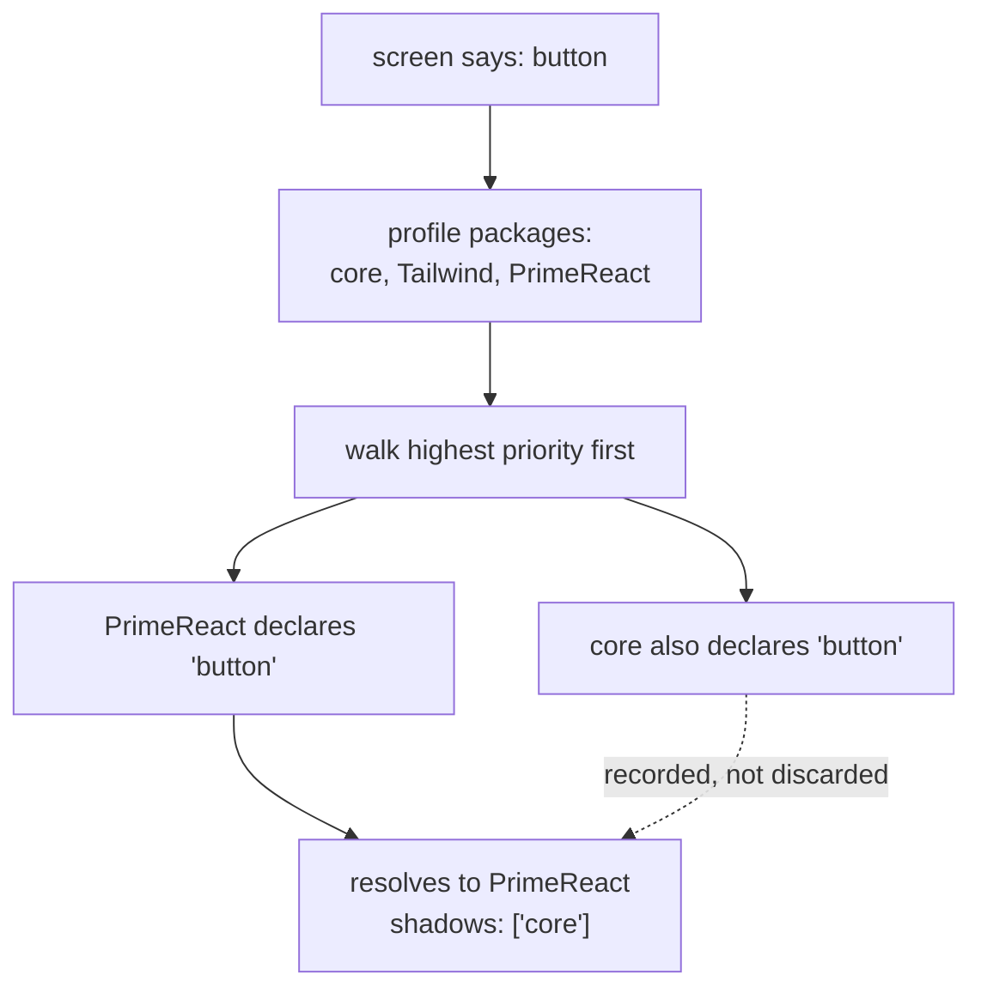

Two packages declaring the same component name sounds like a bug. In Scene it is the feature — it is how a
screen you wrote against the fallback vocabulary becomes a themed application without being edited.

## The friction this removes

Imagine name collisions were forbidden. `core` declares `button`, so PrimeReact would have to declare
something else — `primeButton`, say. Now every screen that says `button` is stuck with the unstyled
fallback forever, and adopting a component library means a find-and-replace across every screen in the
product. Worse, backing that decision out means doing it again in reverse.

Scene resolves the tension by making the name a *request* and the profile the *answer*. The screen keeps
saying `button`. The profile decides which package answers.

## How a bare name resolves

A `ui profile`'s `packages` list is an ascending priority order — later entries outrank earlier ones — and
`core` is always prepended as the final fallback whether or not the profile lists it.



The shadowed packages are kept rather than thrown away, so tooling can answer *why* a name resolved the way
it did, not merely *what* it resolved to.

```ts
import { resolveComponentName } from '@cratis/scene.engine';
import { corePackageManifest } from '@cratis/scene.react';
import { primeReactPackageManifest } from '@cratis/scene.primereact';

const profile = { name: 'web', targetPlatform: 'web', packages: ['core', 'PrimeReact'] };
const catalog = {
    core: corePackageManifest.components,
    PrimeReact: primeReactPackageManifest.components,
};

const resolution = resolveComponentName('button', profile, catalog);
// resolution.package  -> 'PrimeReact'
// resolution.shadows  -> ['core']
```

Reverse the profile's package list and the answer reverses with it. Nothing about the screen changes.

## The three names shared with core

`core` declares exactly three component names, and this package deliberately declares all three:

| Name | `core` renders | PrimeReact package renders |
| --- | --- | --- |
| `text` | a bare `<span>` | a `<span>` that follows the theme's type and muted colors |
| `button` | a bare `<button>` | PrimeReact's `Button`, with severity, outline, icon and loading state |
| `card` | a bare `<div>` | PrimeReact's `Card`, with title and subtitle |

This is the smallest possible demonstration of why override priority exists: the same screen, the same
names, better output the moment a component library joins the profile.

## Qualifying a name explicitly

A name containing a dot is package-qualified and bypasses the priority walk entirely — the author has
already disambiguated, so there is nothing to decide and nothing to shadow.

```ts
resolveComponentName('core.button', profile, catalog);
// resolution.package -> 'core'
// resolution.shadows -> []
```

Reach for this when you specifically want the fallback rendering of one element on an otherwise themed
screen. Use it sparingly: a qualified name pins that element to one package forever, which is exactly the
coupling bare names exist to avoid.

## The Screenplay screen vocabulary

Screenplay's screen syntax compiles to directive kinds, and Stage emits those kinds as component names. This
package declares all of them, so a screen compiled from a `.play` file renders through PrimeReact directly
rather than through a translation layer that would have to be kept in step with the compiler.

| Directive kind | What it renders |
| --- | --- |
| `table` | the same adapter as `dataTable` |
| `column` | a column definition consumed by `table` |
| `title` | a real `<h1>`–`<h6>` at the authored level |
| `field` | a labeled value, with the label bound by `aria-labelledby` |
| `section` | a real `<section>` with a heading and a themed rule |
| `summary` | a description list of label/value pairs inside a card |
| `action` | a button whose *intent* maps to a PrimeReact severity |

`action` is a button but not the same adapter as `button`, and the difference is the point. Screenplay
describes an action by intent — is this the main thing to do here, a secondary one, a destructive one — and
that vocabulary is what a screen author writes. Translating intent to a severity happens in one place, so
changing how destructive actions look is one edit rather than one per screen.

## Naming rules

If you are adding a name to this package, or writing a package of your own:

- **Bare names are `lowerCamelCase`** — `inputText`, `dataTable`, `selectButton`.
- **The name follows what the component *is*, not what one library calls it this major version.** This
  package mapped `toggleSwitch` onto PrimeReact 10's `InputSwitch`; PrimeReact 11 renamed that component to
  `ToggleSwitch`, so the abstract name was already right and the port changes only an import.
- **Reuse a name another package declares when you genuinely provide a better implementation of the same
  idea.** Invent a new one when it is a different idea.
- **Registry keys are `<Package>:<name>`** and nothing should build one by hand — call
  `componentRegistryKey` from `@cratis/scene.react`. The separator is deliberately not the dot used for
  qualification in a screen, so a package name containing dots stays unambiguous.

## Next

Names decide *which* component renders. Tokens decide what it looks like — see
[Understanding design tokens](./understanding-design-tokens.md).
